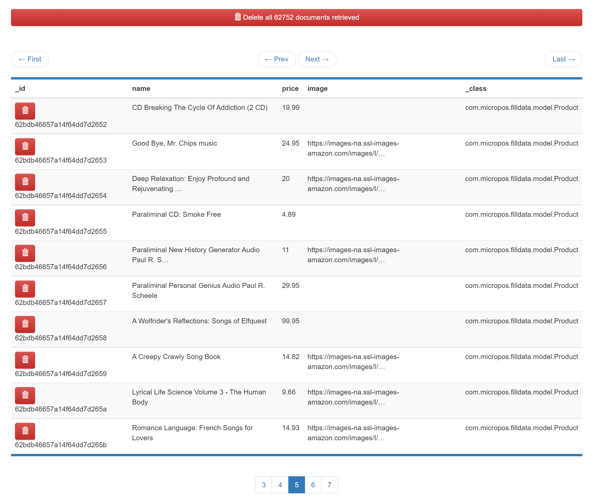
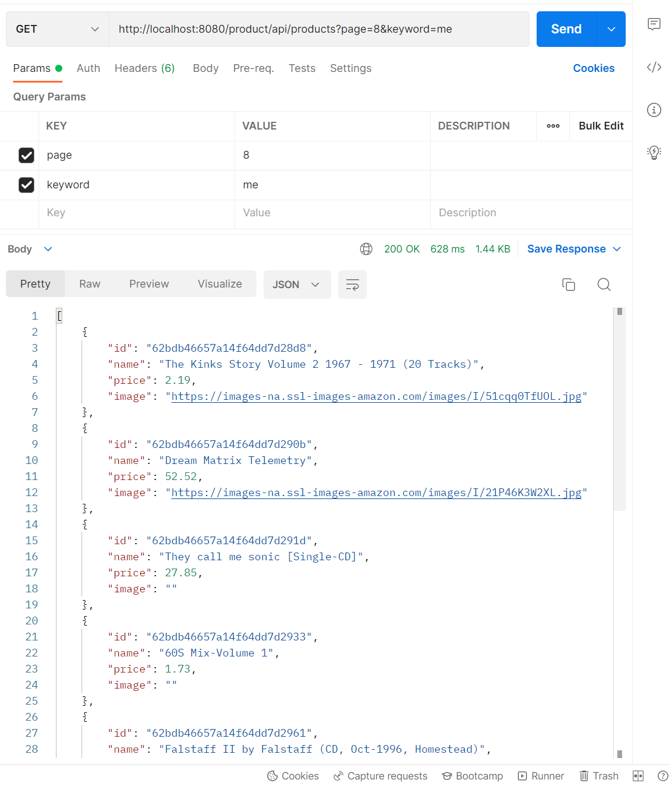

# aw10-final

## 系统介绍

本次实验整合了前面9次实验的代码，使用了微服务架构，架构图如下：


其中，delivery 作为单独服务，通过 spring integration 接入系统，其他模块均依赖 eureka 进行组网和通信。

## 系统使用说明

先进入`docker-compose`目录，用`start-server.sh` 启动容器中的 rabbitmq 和 mongodb/mongodb express

启动完成后可在浏览器中访问 `http://localhost:15672` 和`http://localhost:18081` 查看服务是否正确启动

然后依次启动 
- pos-discovery：eureka 服务器
- pos-fill-data：数据填充服务，支持填充商品数据
- pos-products：商品服务，支持查询、 访问商品
- pos-counter：总价计算器服务，支持计算购物车总价
- pos-carts：购物车服务，支持添加商品、查询购物车、结算总价、结账
- pos-orders：订单服务，支持创建、查询订单
- pos-delivery：运单服务，支持创建、查询运单
- pos-gateway：网关服务，提供转发

按添加购物车、添加商品、结算、查订单、查物流状态的顺序使用系统，

完毕后用 `stop-server.sh` 关闭容器。

### pos-discovery

port:8761

eureka 服务器，用于微服务间的组网和发现

### pos-fill-data

数据导入模块，沿用 aw06 的批处理思路，用 spring batch 从 amazon 的 meta json 文件中导入商品列表，不过数据库从 mysql 变成了支持响应式的 mongodb。

导入 60000 条左右的数据，效果如下：



### pos-gateway

port:8080

api 的 gateway，为以下服务提供转发
- pos-carts
- pos-products
- pos-orders
- pos-delivery

使用示例
```
GET http://localhost:8080/cart/api/carts
GET http://localhost:8080/product/api/products
GET http://localhost:8080/order/api/orders
GET http://localhost:8080/delivery
```

### pos-products

商品查询和展示服务，数据取自 fill-data 后的 mongodb，支持按 id 搜索和按 name 模糊搜索

出于数据量太大的考虑，展示结果分页，每页展示10条商品信息

使用示例
```
模糊查询商品 me 的第8页
GET http://localhost:8080/product/api/products?page=8&keyword=me
```



### pos-cart

购物车服务，功能如下
- 创建购物车
- 添加商品
- 展示全部/指定购物车
- 计算总价
- 结账

使用示例
```
查询所有购物车
GET http://localhost:8080/cart/api/carts

添加编号为 3 的购物车
POST http://localhost:8080/cart/api/carts
{
    "id":3,
    "items":[]
}

给 1 号购物车添加商品
POST http://localhost:8080/cart/api/carts/1
{
    "amount":5,
    "product":{
        "id": 12358894,
        "name": "java core 2",
        "price": 28.5,
        "image": "www.java.com"
    }
}

计算 1 号购物车总价
GET http://localhost:8080/cart/api/carts/1/total

结算 1 号购物车
POST http://localhost:8080/cart/api/carts/1/checkout
```


### pos-counter

总价计算器
- 接收 pos-carts 的 checkout 服务的 getTotal(CartDto) ，计算总价并返回

### pos-orders

port:8086

订单服务
- 接收 cart 的 createOrder(CartDto)，创建订单返回 OrderDto

使用示例
```
查询所有订单
GET http://localhost:8080/order/api/orders

查询指定订单
GET http://localhost:8080/order/api/orders/62be764e21cacb230b8a88ff
```

### pos-delivery

port:8087

物流服务

- 每次用户通过 cart 进行 checkout 时，order 通过 streamBridge 发送一个 OrderDto，给 delivery

- delivery 提供一个 Consumer<OrderDto>，创建一个 DeliveryEntry

- user 可以通过 GET 传递 orderId 给 delivery，查询运输状态

使用示例
```
购物车结算
POST http://localhost:8080/cart/api/carts/1/checkout

查看运单状态
GET http://localhost:8080/delivery

实时查看运单更新
http://localhost:8087/api/query?orderId=62c0f9ae1cb113261d6fe8b2
```

## 响应式系统优点

### Responsive

本系统可以对用户需求进行快速响应，主要原因在于，像数据库读写等耗时的 IO 操作，响应式架构可以异步处理，无需阻塞。

本系统中使用了 ReactiveMongoRepository 为商品、购物车、订单、运单等服务提供存储，在效率上比传统的 CrudRepository 要快很多。

### Resilient

本系统采用微服务架构，各个服务之间相对独立，eureka 服务器检测了各个服务的存活状态，可以起到预警作用。

此外，之前实验中使用的断路器机制可以最大程度地减小上游服务故障对下游服务的影响。

### Elastic

- 垂直扩展：各个微服务都可以独立运行于不同机器，提升机器的性能即可轻松扩展。

- 水平扩展：现在所有服务都向同一个 mongodb 实例请求数据，可以改成分布式集群。

### Message Driven

本系统中，有两处使用了消息驱动的设计

- 从订单创建运单的操作采取了消息驱动，这是由于运单的创建和购物车结算时希望看到的场景相关性较低，可以是异步操作。（对比：购物车结算时用户希望立刻看到订单id，所以这是同步操作，不好作为消息驱动实现）

- 物流信息的更新，本系统设置了 scheduler 定时更新运单信息，由于定时的存在没法同步，只能作为异步事件来完成。